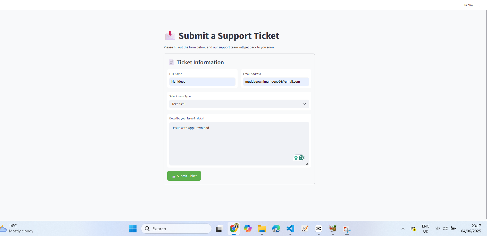
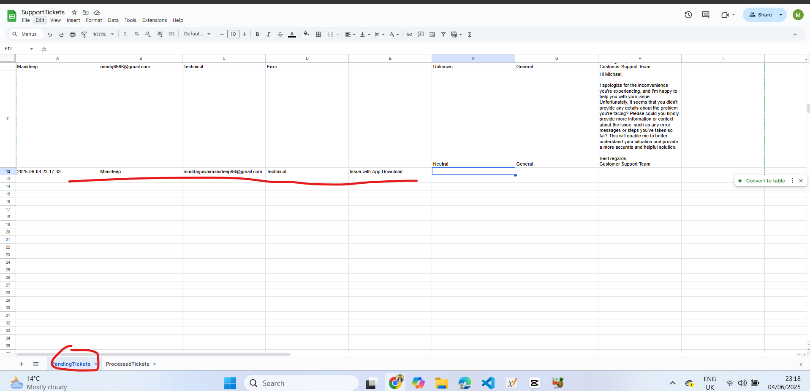
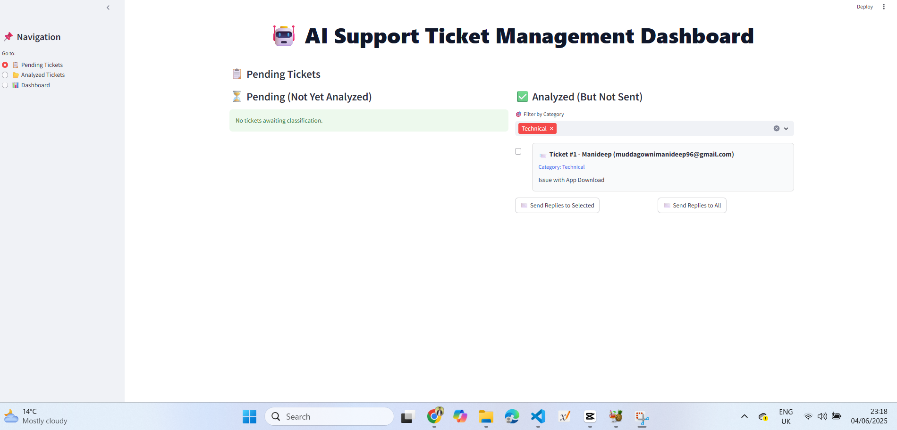
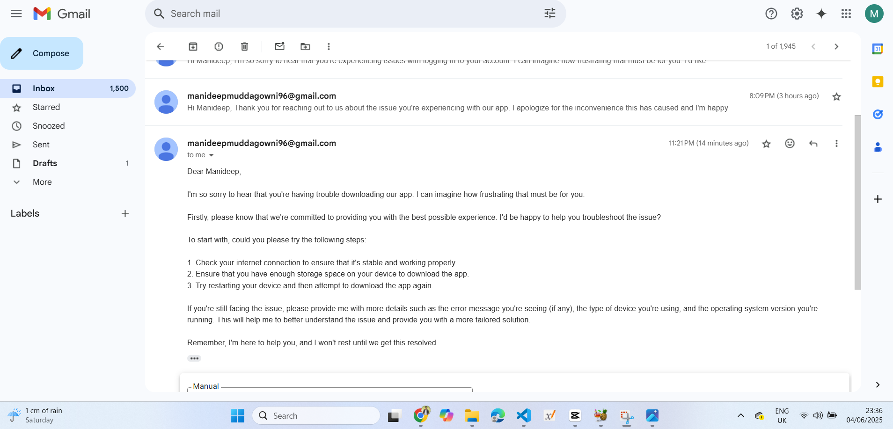
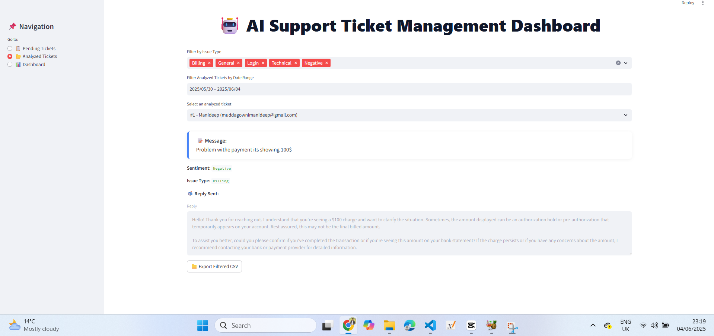
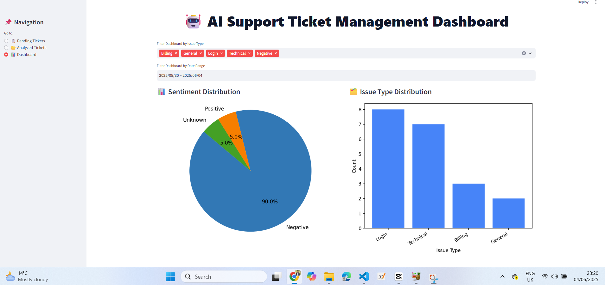
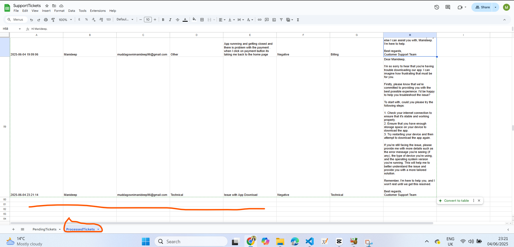
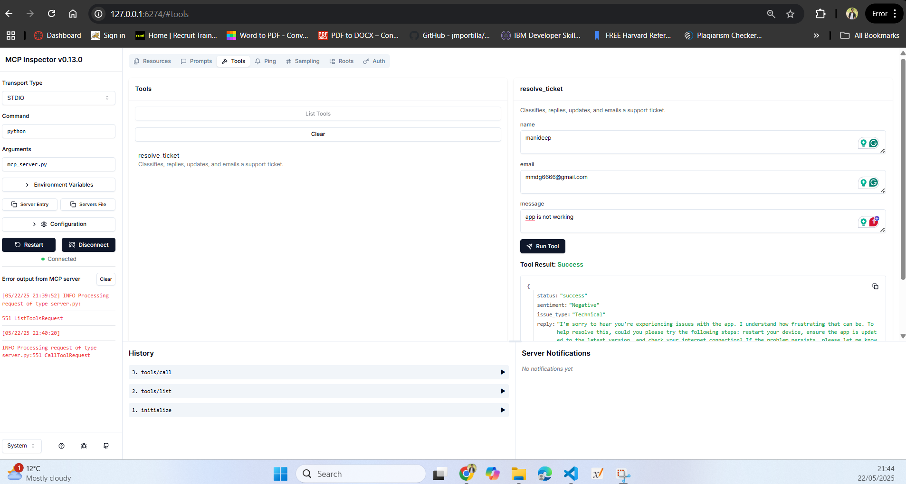

[](https://mseep.ai/app/manideepmuddagowni-customer-support-ticket-automation-using-ai-agents-and-mcp)

# 🤖 AI Customer Support Ticket Resolver Using Agents and MCP (Model Context Protocol)

This Project uses large language models to automate customer support. It classifies tickets, analyzes content, generate and send responses automatically to the given customer email address. Built with Streamlit and MCP Inspector Tool.

## 📦 What It Does

- 📬 Accepts customer support messages or Queries
- 🤖 Uses AI to understand the issue and generate a helpful reply
- 🧠 Detects urgency and classifies the type of request
- 📤 Automatically Sends responses via email
- 📊 Automatically Logs tickets into a Google Sheet
- 🖥️ Has a simple Streamlit web interface and  MCP Inspector Tool

## Demo
videoUrl: https://drive.google.com/file/d/12AznYzfWe23n0x6ZmxI7E7--NwtcBGVO/view?usp=sharing

## 🛠 Installation

### 1. Clone the project

```bash
git clone https://github.com/ManideepMuddagowni/AI-Customer-Support-Ticket-Resolver-Using-MCP.git
```

### 2. Set up Python environment

```bash
conda create -p venv/ python==3.10 -y
```

### 3. Install dependencies

```bash
pip install -r requirements.txt
```

---

## 🔐 API Keys and Config

1. Create a `.env` file with:

```env
GROQ_API_KEY=your_groq_key_here
GMAIL_USER=your_email@gmail.com
GMAIL_APP_PASSWORD=your_gmail_app_password
```

2. Add your `google_cred.json` (Google Sheets API key file) to the project folder.

---

## 🧾 FrontEnd - Customer Support Registration UI (register_ticket.py)

To view the customer support ticket registration form:





### ▶️ Run the UI

streamlit run register.py

This will launch the app in your default browser at:

[http://localhost:8501](http://localhost:8501)

The form allows you to:

* Submit a new support query
* Log responses into Google Sheets

## 🤖 AI Ticket Manager Backend (`main.py`)

The AI Ticket Manager script handles all incoming tickets from the registration UI or external sources.








### 🛠 What It Does

* ✅ Monitors and processes new or pending tickets
* 🔍 Uses AI to classify the ticket by intent and urgency
* ✉️ Generates an intelligent response using LLM
* 📬 Sends the reply to the customer's registered email
* 📝 Logs the full interaction in a Google Sheet
* 🤖 All these are Fully Automated by using Agents

## ⚙️ Commands You’ll Use

### ▶️ Run the web app

```bash
streamlit run main.py
```

This opens the UI in your browser at: http://localhost:8501

---

### 🧠 Set up and run the MCP Server

#### Option A: Simple MCP setup with pip

```bash
pip install fastmcp
```

#### Option B: With UV (optional tool for MCP projects)

```bash
uv init .
uv add "mcp[cli]"
```

---

### 🔁 Install your MCP server

```bash
mcp install mcp_server:mcp
```

---

### 🧰 Use MCP Inspector

#### Option 1: Dev mode with Claude's tools

```bash
mcp dev mcp_server.py
mcp install mcp_server.py
```

#### Option 2: With Node.js inspector

```bash
run - npx @modelcontextprotocol/inspector python mcp_server.py
```

---

## 📌 Troubleshooting

❌ **JSON parse error from MCP**

If you see:

```
Unexpected token ✅, "✅ Email se"... is not valid JSON
```

Remove emojis like ✅ from your `print()` statements. The MCP CLI expects only plain JSON-safe text.

---

---

## 🌐 Deploy Options

- Streamlit Cloud
- Heroku, EC2, or GCP

---

## 🧑‍💻 Contributing

Pull requests are welcome. Feel free to open issues for feature ideas or bugs.

---

## 🚀 Future Improvements & Collaboration

This project is designed with flexibility and growth in mind. Here are a few directions we’re excited to explore next:

### 🔮 Possible Extensions

* **RAG Integration:**

  Enhance responses by using a Retrieval-Augmented Generation (RAG) system. This will let the AI pull relevant info from past tickets, FAQs, or internal documents before generating a reply — making answers more accurate and context-aware.
* **Analytics Dashboard:**

  Track ticket volume, resolution accuracy, response time, and user satisfaction.
* **User Feedback Loop:**

  Let customers rate the AI-generated response to continuously improve performance using reinforcement learning.

---

## 🤝 Open for Collaboration

I am always happy to collaborate with others who are passionate about Machine Learning, NLP, and Gen AI. Whether you're interested in:

* Contributing code
* Integrating new data sources
* Connecting to new platforms

I Would love to connect!

📬 **Reach out via GitHub Issues or start a discussion to get involved.**
